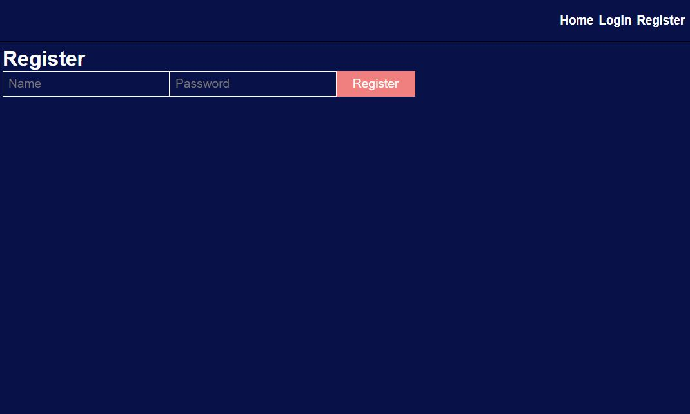
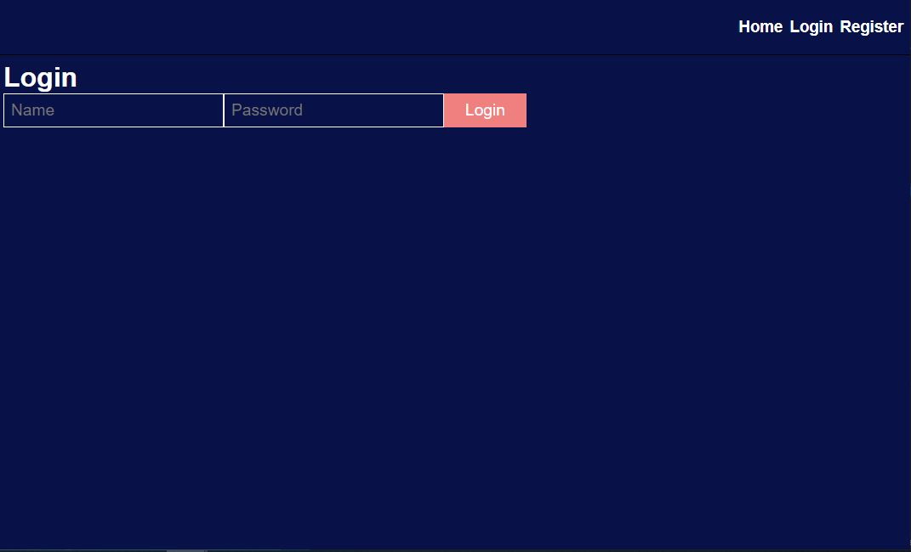
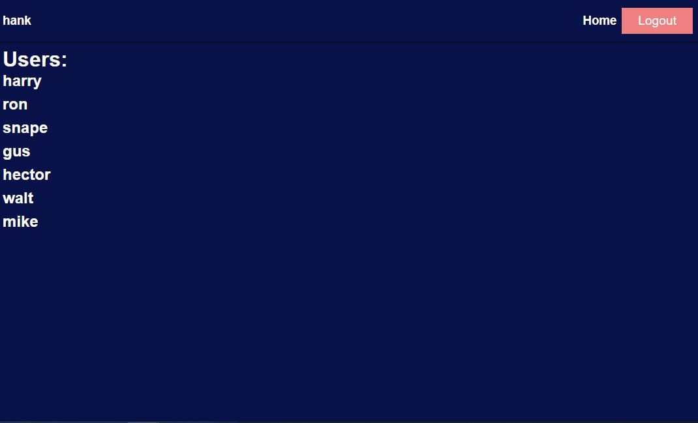
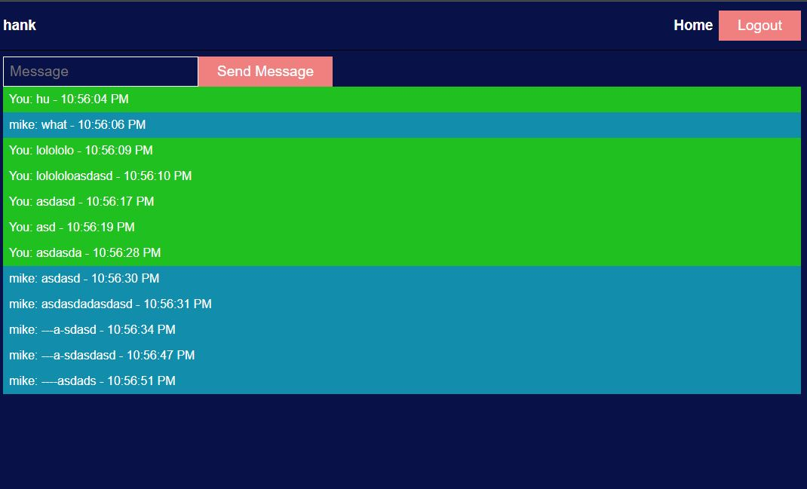

# Assessment Part 4 - React
Deployed Website: [URL](https://aschatreact.onrender.com/)
Back Repository: https://github.com/nashie1004/AssessmentExpress

## Register

## Login

## View All Users

## Chat Room

## Description
A simple chat application with authentication and real time communication with other users using socket.io. 

## Main Libraries used: 
socket.io, express, jsonwebtoken, mongoose, bcrypt, cookie-parser

## Tools used:
1. React.js
2. SASS (for simple styling),
3. Node.js + Express.js
4. MongoDB Atlas + Mongoose